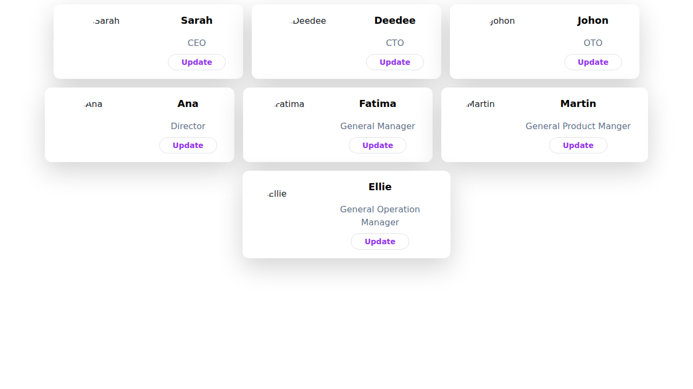

# 👥 Employee Management System

A modern, responsive Employee Management System built with React, Tailwind CSS, and React Bootstrap. This application allows you to view and edit employee information through an intuitive and visually appealing interface.

> 🚀 Built as a demonstration of React state management, component architecture, and modern UI design patterns.

---

## 🌐 Live Demo

[Click here to view the live app](https://mustafa-sarwari.github.io/React/)

---

## 🛠️ Built With


---

## ✨ Features

- ✅ **View Employee List** – Display all employees with their names, roles, and profile images
- ✏️ **Edit Employee Information** – Update employee names and roles through a modal interface
- 🎨 **Responsive Design** – Works seamlessly on desktop, tablet, and mobile devices
- 🔄 **Real-time Updates** – Changes reflect immediately without page reload
- 🎭 **Modern UI** – Clean, professional design with Tailwind CSS styling
- 📦 **Component-based Architecture** – Modular and maintainable React components

---

## 📸 Screenshots



---

## 🚀 Getting Started

### Prerequisites

- Node.js (v14 or higher)
- npm or yarn package manager

### Installation

1. **Clone the repository**
   ```bash
   git clone https://github.com/mustafa-sarwari/React.git
   cd React
   ```

2. **Install dependencies**
   ```bash
   npm install
   ```

3. **Start the development server**
   ```bash
   npm start
   ```

4. **Open your browser**
   
   Navigate to [http://localhost:3000](http://localhost:3000)

---

## 📦 Building for Production

To create an optimized production build:

```bash
npm run build
```

The build folder will contain your optimized application ready for deployment.

---

## 🚢 Deployment

This project is configured for GitHub Pages deployment:

```bash
npm run deploy
```

---

## 📂 Project Structure

```
React/
├── public/
│   ├── photo/           # Employee profile images
│   ├── index.html
│   └── manifest.json
├── src/
│   ├── component/
│   │   ├── Employee.js      # Employee card component
│   │   └── EditEmployee.js  # Edit modal component
│   ├── App.js               # Main application component
│   ├── index.js             # Application entry point
│   └── index.css            # Global styles
├── package.json
├── tailwind.config.js
└── README.md
```

---

## 🎯 Usage

1. **View Employees**: The app displays a grid of employee cards with profile pictures, names, and roles
2. **Edit Employee**: Click the "Update" button on any employee card to open the edit modal
3. **Update Information**: Modify the name and/or role in the form fields
4. **Save Changes**: Click "Update" in the modal to save your changes
5. **Cancel**: Click "Close" to dismiss the modal without saving

---

## 🧪 Running Tests

```bash
npm test
```

---

## 🤝 Contributing

Contributions, issues, and feature requests are welcome! Feel free to check the [issues page](https://github.com/mustafa-sarwari/React/issues).

See [CONTRIBUTING.md](CONTRIBUTING.md) for more details.

---

## 🔒 Security

See [SECURITY.md](SECURITY.md) for information about reporting security vulnerabilities.

---

## 📄 License

This project is licensed under the MIT License - see the [LICENSE](LICENSE) file for details.

---

## 👨‍💻 Author

**Mustafa Sarwari**

- GitHub: [@mustafa-sarwari](https://github.com/mustafa-sarwari)
- LinkedIn: [linkedin.com/in/gm-sarwari](https://www.linkedin.com/in/gm-sarwari/)

---

## 🙏 Acknowledgments

- React team for the amazing framework
- Tailwind CSS for the utility-first CSS framework
- React Bootstrap for the pre-built components
- Create React App for the project setup

---

⭐ **If you found this project helpful, please consider giving it a star!** ⭐
