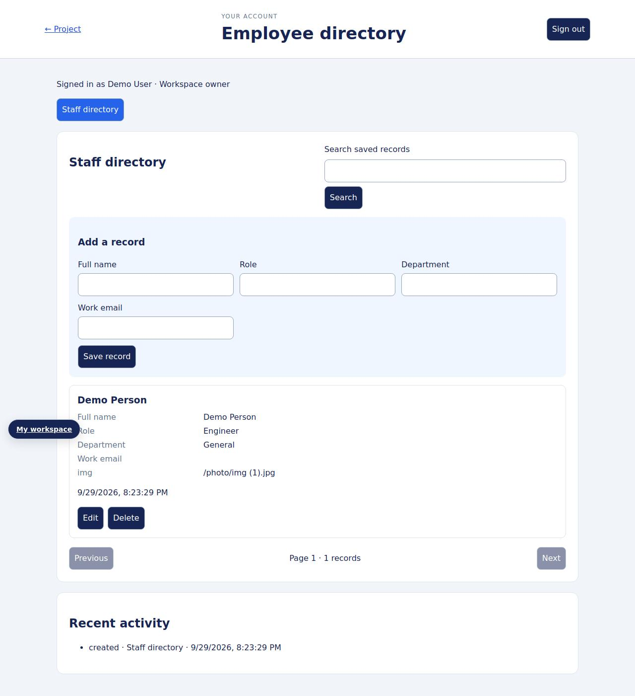

# Employee directory — React and Node.js

Manage employee profiles with account login, persistent CRUD, department fields, and search.

**Frontend:** React 19, React Router, Bootstrap. **Backend:** Node.js 24, HTTP API, SQLite, and account sessions.

Employee edits update the existing record rather than creating duplicates. Development requests use a declared proxy dependency, and the production server serves the React build alongside the API.

## Run locally

```bash
npm ci
npm run build
npm run start:api
```

Open <http://localhost:4000>, choose **Sign in · Account**, and create your local owner account. Open **My workspace** to use the stored workflows. A second account gets member access and its own private data.

## Full-stack implementation

- Email/password accounts with salted scrypt hashes, rotated HttpOnly sessions, expiry, and owner/member roles.
- SQLite-backed `employees` workflows with access checks and server-side validation.
- Connected account screens for stored records, search, paging, and activity; resource permissions control available actions.
- Transactional writes, retry keys, version-aware editing for mutable records, and bounded API requests.

[Backend routes, storage design, and access rules](docs/backend.md) · [Workspace preview](docs/workspace-preview.jpg)



## Verification

`npm run test:api` passes **3 backend tests**, including password hashing, session rotation/expiry, restart persistence, access control, validation, and the repository workflow. `npm ci` and the production build also pass.

The main account and resource flow passed browser checks at 375px and 1280px with no page JavaScript errors or horizontal overflow in those flows. [GitHub Actions](.github/workflows/fullstack.yml) runs the backend suite and frontend build on pushes and pull requests.

## Development

Run `npm run start:api` and `npm start` in separate terminals. The development proxy sends API and account-workspace requests to port 4000. For the single-server production demo, build once and open port 4000.

## Project context

[Mustafa Sarwari](https://github.com/mustafa-sarwari) — junior full-stack developer developing deeper skills in frontend integration, server validation, authentication, persistence, and automated verification. The shared HTTP/workspace foundation is reused across these portfolio projects; the workflows above show each project’s domain behavior. 

Static previews require the Node service for backend features. Orders and messages are local demonstrations; payment processing and email delivery are outside their implemented scope.
