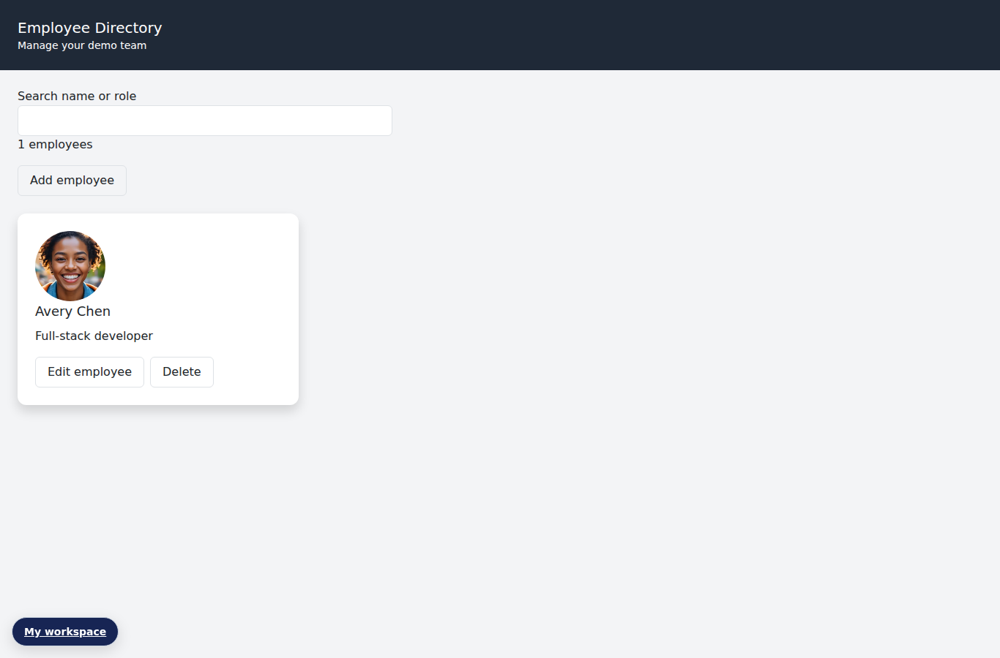

# Employee Directory — React profiles with persistent editing

A small employee directory that lets a signed-in user create, search, edit and remove stored profiles. The main React interface and the account workspace use the same employee API.

**Demo status:** Local full-stack app; no cloud deployment required.




[Watch the short local demo](docs/demos/walkthrough.mp4) · [Repeat the demo](docs/DEMO.md)

## Main workflow

Add an employee → search by name or role → edit the existing profile → refresh to verify the change.

## Architecture and decisions

React 19, React Router and Bootstrap, built with Create React App → Node.js 24 HTTP API → SQLite employee records and account sessions.

- Editing uses PATCH on the existing employee ID instead of creating a duplicate.
- The React screen searches names and roles; the workspace also exposes department and email fields.
- The production server serves the React build and API from one origin. Development uses the declared proxy dependency.

Accounts use salted scrypt password hashes and expiring HttpOnly sessions. The shared account/API foundation is reused across these portfolio applications; the domain behavior above is specific to this project.

## Run locally

Use Node.js 24. From this repository in PowerShell:

```powershell
npm ci
npm run build
npm run start:api
```

Open http://localhost:4000. Choose **Sign in · Account**, then **Create an account**. Use a password of 12–128 characters. The first account receives owner access; later accounts receive member access. Saved local data lives in the ignored `.data/` directory.

For live frontend development, run `npm run start:api` and `npm start` in separate terminals.

## Verification

```powershell
npm run test:api
```

The backend suite exercises account security and the application’s domain workflow. CI also checks the frontend build. See [GitHub Actions](.github/workflows/fullstack.yml) and [backend reference](docs/backend.md). Capture details and their limits are recorded in [the demo guide](docs/DEMO.md).

## Limits

This is a portfolio directory, not an HR system. There is no payroll integration, invitation flow or organizational directory sync. Create React App is retained rather than presenting this as a newer Vite project.

Built and maintained by [Mustafa Sarwari](https://github.com/mustafa-sarwari). Existing source credits and licenses are preserved.
